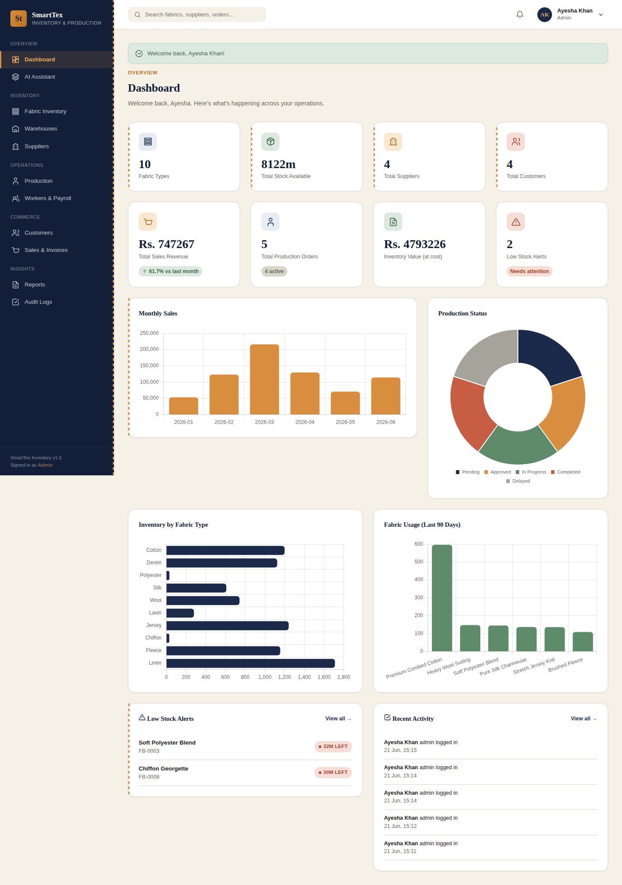

# SmartTex Inventory

**AI-Powered Textile Inventory & Production Management System**

A full-stack web application built for textile factories, garment manufacturers, fabric warehouses, and textile businesses — covering inventory, procurement, production, HR, sales, reporting, and AI-driven insights in one platform.



---

## Tech Stack

| Layer | Technology |
|---|---|
| Frontend | HTML5, CSS3 (custom design system), Vanilla JavaScript, Chart.js |
| Backend | Python 3.12, Flask 3, Flask-Blueprints |
| ORM / Database | SQLAlchemy, SQLite (dev) / MySQL (production) |
| Auth | Flask-Login, Flask-WTF (CSRF), Werkzeug password hashing |
| AI / ML | scikit-learn (linear regression forecasting, anomaly detection), pandas, NumPy |
| Documents | ReportLab (PDF invoices & reports), OpenPyXL (Excel exports) |
| Identification | `qrcode`, `python-barcode` (Code128) for fabric roll tracking |

---

## Features

### Core Modules
1. **Dashboard** — KPIs, monthly sales chart, inventory trends, production analytics, revenue growth, fabric usage stats, low-stock alerts, recent activity feed.
2. **Fabric Inventory** — Full CRUD, QR + barcode generation per roll, stock movement ledger, low-stock alerts, damaged-stock tracking, inter-warehouse transfers, search & filters.
3. **Supplier Management** — Supplier directory, purchase orders with line items, payment tracking, on-time delivery rate, AI-ranked performance.
4. **Warehouse Management** — Multiple warehouses, capacity utilization tracking, per-warehouse stock visibility.
5. **Production Management** — Production orders with fabric reservation/consumption, waste tracking, efficiency %, status workflow (Pending → Approved → In Progress → Completed/Delayed).
6. **Worker Management** — Worker records, daily attendance, payroll generation with overtime/bonus/deductions.
7. **Customer Management** — Customer directory with purchase history and lifetime value.
8. **Sales Management** — Invoice creation with live stock validation, tax/discount, PDF invoice generation, payment tracking.
9. **Reporting System** — Inventory, Supplier, Warehouse, Sales, Production, Employee, and Financial reports — each exportable as PDF, Excel, or CSV.
10. **Notifications** — automatically generated in-app alerts for low stock, approaching/overdue production deadlines, and overdue supplier payments (checked on every dashboard load; never duplicates an alert that's already unread).
11. **Team Chat** — a shared, Slack-style channel where Admin and all managers can post and read messages from each other in near real time (3-second polling, no extra setup required).
12. **History** — every deleted fabric, supplier, warehouse, worker, and customer in one place (Admin only), with who deleted it, when, and a one-click **Restore**. Deleting something never erases it — it's just hidden from active lists/dropdowns while staying fully visible in any past invoice, purchase order, or production order that references it.
13. **Audit Logs** — Every create/update/delete/login action is logged with user, module, and timestamp (Admin-only view).
14. **AI Features**
    - **Sales/Demand Forecasting** — linear regression over historical data, with an honest confidence label (and naive fallback when data is sparse).
    - **Smart Reorder Recommendations** — based on usage history, lead time, and safety stock.
    - **Anomaly Detection** — z-score based flagging of unusual stock movements.
    - **Supplier Recommendation** — transparent weighted scoring (on-time delivery 40%, cost 35%, rating 25%).
    - **AI Chat Assistant** — answers natural-language questions about live stock, suppliers, and sales data.

### Role-Based Access Control
Four roles with distinct permissions: **Admin**, **Inventory Manager**, **Production Manager**, **Sales Manager**. See [`docs/ROLES.md`](docs/ROLES.md) for the full permission matrix.

---

## Quick Start

```bash
# 1. Clone/extract the project, then create a virtual environment
cd smartex-inventory
python3 -m venv venv
source venv/bin/activate        # Windows: venv\Scripts\activate

# 2. Install dependencies
pip install -r requirements.txt

# 3. Initialize the database (SQLite by default — zero config)
flask --app run.py init-db

# 4. (Optional but recommended) Load demo data so every module has content
flask --app run.py seed-db

# 5. Run the app
python run.py
```

Visit **http://127.0.0.1:5000** and log in with:

```
Username: admin
Password: admin123
```

> ⚠️ Change this password immediately in any real deployment (Profile → Change Password).

For full setup instructions including MySQL migration, see [`docs/INSTALLATION.md`](docs/INSTALLATION.md).

---

## Project Structure

```
smartex-inventory/
├── app/
│   ├── ai/                    # Forecasting, anomaly detection, chat assistant logic
│   ├── blueprints/            # One folder per module (routes + forms)
│   │   ├── auth/
│   │   ├── dashboard/
│   │   ├── fabrics/
│   │   ├── suppliers/
│   │   ├── warehouses/
│   │   ├── production/
│   │   ├── workers/
│   │   ├── customers/
│   │   ├── sales/
│   │   ├── reports/
│   │   ├── notifications/
│   │   ├── audit/
│   │   └── ai_assistant/
│   ├── models/                 # SQLAlchemy models, one file per domain
│   ├── static/                 # CSS, JS, generated QR/barcode images
│   ├── templates/               # Jinja2 templates, mirrors blueprint structure
│   ├── utils/                   # Decorators, code generators, PDF/Excel builders
│   ├── config.py
│   └── extensions.py
├── docs/                        # ER diagram, installation guide, API docs, roles
├── sql/                         # MySQL schema script
├── instance/                    # SQLite database file lives here (gitignored)
├── requirements.txt
├── run.py                       # Application entry point
└── .env.example
```

---

## Database

The app uses **SQLite by default** (zero setup, file-based, perfect for development or small deployments) and is **MySQL-ready** for production — switch by setting the `DATABASE_URL` environment variable. See [`sql/schema.sql`](sql/schema.sql) for the full MySQL DDL and [`docs/ER_DIAGRAM.md`](docs/ER_DIAGRAM.md) for the entity relationship diagram.

17 tables covering users, fabrics, inventory movements, suppliers, purchase orders, warehouses, transfers, customers, sales orders, production orders, workers, attendance, payroll, notifications, and audit logs.

---

## Notes on the AI Features

This system is designed to be honest about data sufficiency rather than simulating false confidence:

- **Forecasts** explicitly state their method (`linear_regression` vs `naive` trend projection) and a **confidence level** (High/Medium/Low/None) based on how much historical data exists.
- **Reorder recommendations** disclose whether they're based on real usage history or a fallback threshold calculation.
- **Supplier rankings** show their scoring weights so the recommendation isn't a black box.
- **Anomaly detection** uses statistical z-scores, not arbitrary thresholds, and explains its sample size.

As you use the system and accumulate real operational data, every one of these features will sharpen automatically — no model retraining required, since they compute directly from your live database.

---

## License & Support

Built as a complete, professional reference implementation. See [`docs/API.md`](docs/API.md) for route documentation if you plan to integrate or extend the system.
