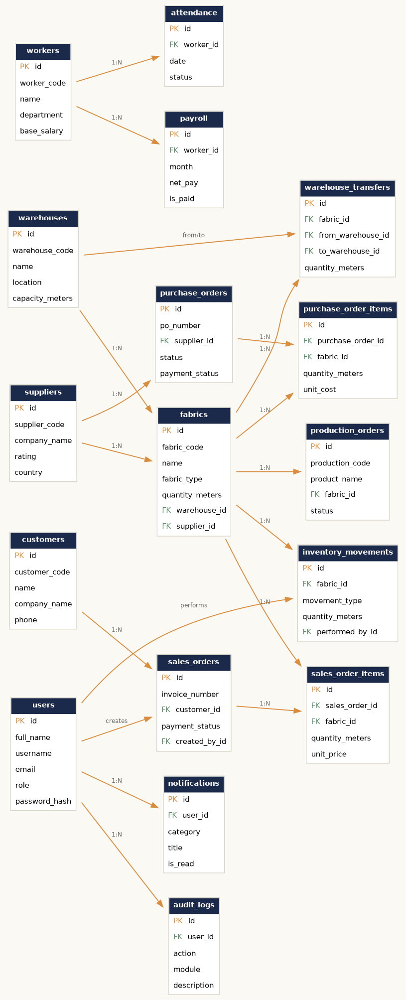

# Entity Relationship Diagram

## Overview

The schema is organized around **Fabrics** as the central inventory entity, with every other module either feeding stock into it (Suppliers → Purchase Orders) or drawing stock out of it (Sales Orders, Production Orders, Warehouse Transfers). The **Inventory Movements** table is an append-only ledger — every quantity change in the system, regardless of source, is recorded there, which is what powers the stock movement history, the audit trail, and the AI forecasting/anomaly detection features.

## Tables (17 total)

| Table | Purpose |
|---|---|
| `users` | Authentication, roles |
| `warehouses` | Physical storage locations |
| `suppliers` | Vendor directory |
| `fabrics` | Core inventory item (one row per fabric/roll type per warehouse) |
| `inventory_movements` | Append-only ledger of every stock change |
| `purchase_orders` / `purchase_order_items` | Procurement from suppliers |
| `warehouse_transfers` | Inter-warehouse stock movements |
| `customers` | Buyer directory |
| `sales_orders` / `sales_order_items` | Customer invoices and line items |
| `production_orders` | Manufacturing jobs that consume fabric |
| `workers` | Factory floor staff |
| `attendance` | Daily attendance records |
| `payroll` | Monthly payroll calculations |
| `notifications` | In-app alerts per user |
| `audit_logs` | System-wide action history |

## Key Design Decisions

**Why a separate `inventory_movements` ledger instead of just updating `fabrics.quantity_meters`?**
Because a single running total can't answer "what happened, when, and why" — which matters for audits, for diagnosing discrepancies, and for the AI's usage-based reorder recommendations and anomaly detection. The ledger is the source of truth for *history*; `fabrics.quantity_meters` is a fast-access cache of the *current* total, kept in sync by the application layer on every movement.

**Why do warehouse transfers create a new `fabrics` row at the destination (in some cases) rather than just moving a quantity?**
A fabric's identity is `(name, type, color, warehouse)` for practical warehouse-floor purposes — the same fabric in two different warehouses is tracked as two inventory positions, each with its own QR/barcode, so staff scanning a roll always know which location they're looking at. The transfer is still logged once in `warehouse_transfers` for traceability.

**Why is `reserved_meters` separate from `quantity_meters`?**
When a production order is created, fabric is reserved (taken out of "available" stock) without yet being physically consumed. This prevents two production orders or a sales order from double-booking the same fabric, while still showing the true physical quantity on hand.

**How does soft-delete work?**
`fabrics`, `suppliers`, `warehouses`, `workers`, and `customers` each carry `is_active`, `deleted_at`, and `deleted_by_id`. Deleting one of these sets `is_active = FALSE` and records who/when — it's filtered out of active lists and dropdowns everywhere, but the row itself is untouched, so any `sales_order_items`, `purchase_order_items`, or `production_orders` row that references it still resolves correctly. The **History** page (Admin only) lists every soft-deleted record across all five tables and can flip `is_active` back to `TRUE` (clearing `deleted_at`/`deleted_by_id`) — a full restore.

See [`sql/schema.sql`](../sql/schema.sql) for full column definitions, types, and foreign key constraints.
